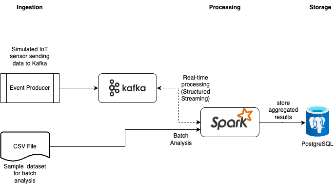

# Data processing with Apache Kafka, Spark, and PostgreSQL

---

## Functional Overview

This project simulates a full data processing pipeline for IoT sensor data, covering real-time and batch analytics. Sensor readings are continuously generated and published to a Kafka topic. Spark Structured Streaming consumes this data in real time, performs aggregations (average temperature and humidity per city and minute), and writes the results to a PostgreSQL database. Additionally, a batch job processes historical CSV data to compute metrics, storing the outcome in a separate PostgreSQL table.

This project demonstrates a complete pipeline for ingesting, processing, and analyzing data using the following components:

- **Kafka**: for real-time ingestion of simulated sensor data.
- **Spark**: for both real-time processing (Structured Streaming) and batch analysis of historical data.
- **PostgreSQL**: for storing aggregated results.
- **Kafka UI**: for inspecting topics and messages in Kafka.
- **pgAdmin**: for visualizing PostgreSQL tables and running queries.



---

## Project Structure

```
iot-demo/
├── docker-compose.yml
├── producer/               # Simulated IoT sensor sending data to Kafka
│   ├── Dockerfile
│   └── producer.py
├── spark_app/              # Spark streaming and batch jobs
│   ├── spark_app.py        # Real-time streaming from Kafka to PostgreSQL
│   └── spark_batch.py      # Batch analysis from CSV to PostgreSQL
├── spark_data/
│   └── iot_data.csv        # Sample IoT dataset for batch analysis
└── db/
    └── init.sql            # PostgreSQL initialization with required tables
```

---

## ▶How to run

### Prerequisites
- Docker & Docker Compose installed

### Step-by-step

1. **Start all services**:
   ```bash
   docker compose up --build
   ```

2. **Access interfaces**:
   - Kafka UI: [http://localhost:8080](http://localhost:8080)
   - pgAdmin: [http://localhost:5050](http://localhost:5050)
     - Login: `admin@admin.com` / `admin`

3. **Inspect PostgreSQL**:
   - Connect to server `postgres`, database `demo_iot`
   - Tables:
     - `iot_metrics` – real-time aggregated data (streaming)
     - `iot_batch_metrics` – results from historical batch analysis

4. **Run batch analysis manually** (optional):
   ```bash
   docker compose exec spark \
     /opt/bitnami/spark/bin/spark-submit \
     --packages org.postgresql:postgresql:42.7.3 \
     /opt/spark-app/spark_batch.py
   ```

---

## Real-Time Streaming

- The `producer` service simulates sensor data and publishes it to Kafka every second.
- `spark_app.py` consumes messages from Kafka topic `iot-sensor`, aggregates them per city and 1-minute window, then saves the results to PostgreSQL (`iot_metrics`).

---

## Batch Analysis

- The `spark_batch.py` script reads a large CSV file (`spark_data/iot_data.csv`) and calculates average temperature and humidity per city.
- The result is stored in the `iot_batch_metrics` table in PostgreSQL.

---

## Notes

- Kafka UI lets you browse topics, view messages, consumer offsets, etc.
- pgAdmin allows you to run SQL queries against your data.
- Both streaming and batch jobs write to PostgreSQL using JDBC.

---

## Stop all containers

```bash
docker compose down
```
